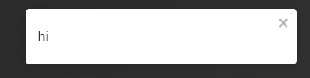

# Teams Clone (Project Submission for Engage)

## **⚡️** Hosted On

I am Using netlify for hosting the Client and Heroku for signaling server (Expect a cold start on initial app load, since Heroku kills the server if not pined in some time), The domain is provided by freenom.com

Live Link: [Engage Project](https://engage-project.ml)

## **⚙️** Instructions To Run Locally

**Note:** I am aware that I shouldn't expose my public keys on GitHub and restrict the CORS policies, but I didn't so the project can can be tested on any machine without any hiccup.

1. Clone the repo using `git clone --recursive https://github.com/Nishit-Dua/Teams-Clone.git`
2. Change the Directory by `cd ./Teams-Clone `
3. `npm install` in the current directory
4. run `npm run ready` to install the dependencies for both the client and server simultaneously
5. run `npm start` to Fire up the development servers, the React client would be available at http://localhost:3000/

## **🎯** Features

[Feature Showcase 😎](#feature-showcase)

1. Can **connect with multiple peers** at once
2. Can share the room with the URL as a **unique URL is made for every Room**.
3. A Small Cyan Blue **Halo around people who are currently speaking!**
4. **Text Chat which Persist** Before and After the call so, if you have the link to the Room you can check out the chat anytime :D
5. **Ability To share your screen**
6. **Ability to Raise hand**, Every peer in the call will get a small sound and an icon bottom right of the person who raised his hand!
7. When ever there is a **new message a small toast** with a sound shows up for 2 seconds.
8. Video/Audio Can be turned off/on.
9. **ChatRoom**, Similar to a normal Video Room '/room/roomId' we have the URL in the form '/chatroom/roomId' _people in the chat room can still talk with the people in the Video chat room and vice-versa_
10. **User Authentication**, If a User Joins in as a guest others will know that the person is a guest login!

## **💡** Project Structure

The Project Uses a peer-to-peer architecture, every node in the mesh is connected to every other node and hence we get a N^2^ Total connections for a Room! Another architecture that I could have used sent all data to the server and the server broadcasts the stream, so peers are just connected to the server and hence it's more scalable but requires a higher duty server, I am using a free Heroku space so that was out bounds for me.

### Client 💻

This Client Code is Written In React With Typescript and Scss, Firebase as Database and Socket as the Signaling Server for WebRTC, I used a simple library wrapper around the WebRTC API called 'simple-peer'.

The Project Uses Functional Components with Reacts Context API for majority of state management, and has local states mixed in for rendering performance. (Context shakes up the render tree, whereas state just retenders the component)

<pre>
.
├── App.tsx
├── assets
│   ├── discord-join.mp3
│   ├── discord-leave.mp3
│   ├── discord-notification.mp3
│   └── hand-up.wav
├── components
│   ├── ChatLibrary.tsx : 191
│   ├── Loader.tsx : 8
│   ├── Navbar.tsx : 28
│   ├── SingleVideo.tsx : 44
│   └── VideoChats.tsx : 308
├── context
│   ├── AppProvider.tsx : 35
│   ├── AuthProvider.tsx : 107
│   └── reducer.ts : 37
├── firebaseConfig.ts : 9
├── index.tsx : 21
├── pages
│   ├── AnonLogin.tsx : 77
│   ├── ChatRoom.tsx : 27
│   ├── Homepage.tsx : 72
│   ├── Landingpage.tsx : 156
│   ├── Room.tsx : 108
│   └── WrongUrl.tsx : 20
├── react-app-env.d.ts : 11
├── styles :
│   ├── Homepage.scss : 48
│   ├── anonLogin.scss : 73
│   ├── chat.scss : 216
│   ├── index.scss : 70
│   ├── landing.scss : 206
│   ├── loader.scss : 58
│   └── room.scss : 203
└── utils
    ├── PrivateRoute.js : 30
    ├── auth-firebase.ts : 16
    ├── const.ts : 23
    ├── types.ts : 23
    └── useDisconnect.ts : 10
6 directories, 34 files, 2235 lines of code
</pre>

The Call Joining Logic Is In **/components/VideoChats.tsx** and the chat logic is in **/components/ChatLibrary.tsx**

### Server 🔧

Server Has a much Simpler logic as it just act as a signaling server for the WebRTC PeerConnections

<pre>
.
└── index.js : 90
</pre>

I used Socket-io and express for the server, Since the code base is quite small I decided to just use JavaScript instead of Typescript!

## 🤩 Feature Showcase

Hand Emoji when person raises his hand

Toast Notification when getting a new message

Ability to share Your screen!

Buttons conditionally rendering on the state.

Chat Room for when you dont want to be in a video call!

Chat Library for when you are in a video call and want to chat!
